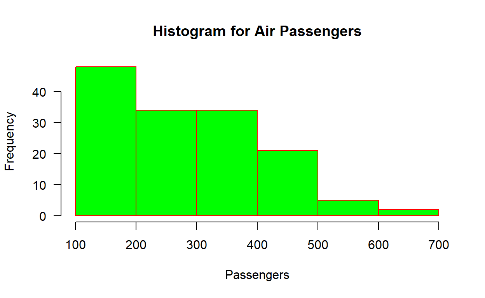

This is my first attempt at a blog post in R,whew!

I am going to import data from the Air Passengers data set which is included in R. It is comprised of data from the monthly totals of international airline passengers, 1949 to 1960. I am going visually express the data on a histogram plot which is a strength of R.


<div class="layout-chunk" data-layout="l-body">
<div class="sourceCode"><pre class="sourceCode r"><code class="sourceCode r"><span class='fu'><a href='https://rdrr.io/r/graphics/hist.html'>hist</a></span><span class='op'>(</span><span class='va'>AirPassengers</span>, 
     main<span class='op'>=</span><span class='st'>"Histogram for Air Passengers"</span>, 
     xlab<span class='op'>=</span><span class='st'>"Passengers"</span>, 
     border<span class='op'>=</span><span class='st'>"red"</span>, 
     col<span class='op'>=</span><span class='st'>"green"</span>,
     xlim<span class='op'>=</span><span class='fu'><a href='https://rdrr.io/r/base/c.html'>c</a></span><span class='op'>(</span><span class='fl'>100</span>,<span class='fl'>700</span><span class='op'>)</span>,
     las<span class='op'>=</span><span class='fl'>1</span>, 
     breaks<span class='op'>=</span><span class='fl'>5</span><span class='op'>)</span>
</code></pre></div>


</div>


 


```{.r .distill-force-highlighting-css}
```
